# ERA5-SWVL1-SR : Downscale swvl1 from ERA5 resolution to ERA5-Land resolution

## Table of Contents
- [ERA5-SWVL1-SR : Downscale swvl1 from ERA5 resolution to ERA5-Land resolution](#era5-swvl1-sr--downscale-swvl1-from-era5-resolution-to-era5-land-resolution)
  - [Table of Contents](#table-of-contents)
  - [Description](#description)
  - [Data Processing](#data-processing)
  - [Model](#model)
    - [Architecture](#architecture)
    - [Training](#training)
  - [Results](#results)
    - [Metrics](#metrics)
    - [Visuals based on unseen data](#visuals-based-on-unseen-data)
  - [Usage](#usage)
  - [Acknowledgments](#acknowledgments)
  - [References](#references)
  - [Contributing](#contributing)
  - [License](#license)
  - [Roadmap](#roadmap)
  - [Contact](#contact)

## Description
Soil moisture is the quantity of water in the soil, vital for plant growth and a pivotal element in agriculture, hydrology, and environmental science. The precision of soil moisture measurements poses a challenge. Although remote sensing enables access to soil water content data, the resolution is often too coarse for detailed analyses in specific regions. This raises the question of how gridded soil moisture data can be downscaled to enable more refined analyses in smaller geographical areas.

This project uses a Super Resolution Generative Adversarial Network (SRGAN) model to downscale soil moisture data from a resolution of 0.25°x0.25° to a resolution of 0.1°x0.1°. The soil moisture in the top $7cm$ soil layer is considered and represents the volume of water in the top layer. Named Volumetric Soil Water Layer 1 (Swvl1), the output values for soil moisture in this layer range from 0 to 1.

Here, the soil moisture data is downloaded from Copernicus website at the resolutions mentioned before:

- ERA5 swvl1 data is available with a resolution of 0.25°x0.25° and can be downloaded here : https://cds.climate.copernicus.eu/cdsapp#!/dataset/reanalysis-era5-single-levels?tab=form

- ERA5-Land swvl1 data is available with a resolution of 0.1°x0.1° and can be downloaded here : https://cds.climate.copernicus.eu/cdsapp#!/dataset/reanalysis-era5-land?tab=form 

For both resolutions, the data is downloaded on the entire world at 12:00 UTC between 1990 and 2022. The data is downloaded at 12:00 UTC because of the small variation of soil moisture throughout a day. The data between 1990 and 2011 is used for the training and the data between 2012-2022 is used for testing.

## Data Processing
Prior to inputting the data into the model, an initial preprocessing step is undertaken for ERA5 data. The nan values and the values below a tolerance level of $1e^{-6}$ are set to a default value of 0. Given that the model's architecture is configured to increase resolution by a factor of $2^p, p \in \mathbb{N}$, ERA5 data undergoes interpolation to create a dataset with a 0.4°x0.4° resolution. The interpolated ERA5 data is randomly cropped to form a patch of size 16x16. This patch serves as the training input for the model, enabling a ÷4 downscaling.

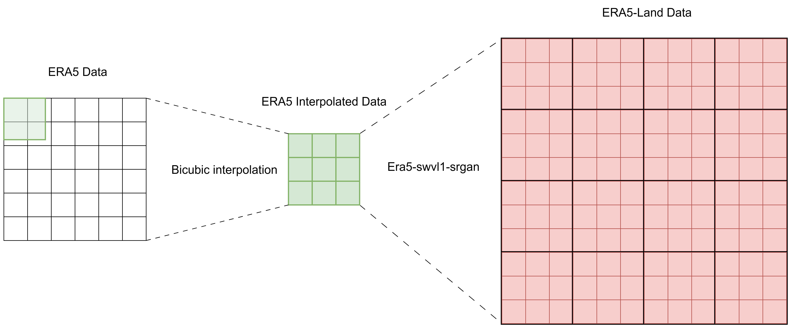


## Model

### Architecture

The GAN model used in this project consists of a generator and a discriminator. It is inspired from the original SRGAN paper but with a slight modifications. The revisited architecture looks like this:

**Generator Network**
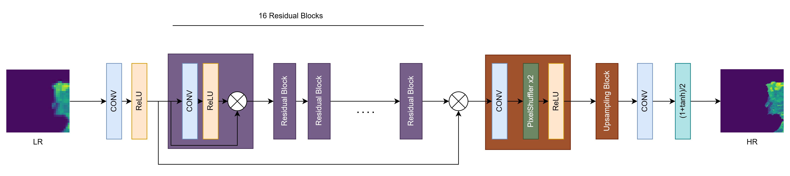

**Discriminator Network**
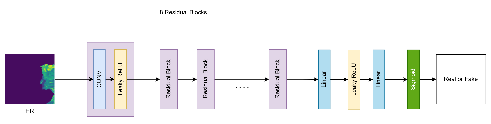

In the Residual blocks of the Generator, the Batch Normalization layer was removed and a ReLu layer was used instead of the PReLu. Additionally, each residual block only contains one convolution layer. The Generator accepts 16x16 patches as input, scaling them up to 64x64.

When it comes to the discriminator, the network remains largely unchanged, with the exception of the removal of Batch Normalization layers from the blocks. The discriminator accepts patches of 64x64 as input.

### Training

The training process involved utilizing the Adam optimizer with beta values set at (0.9, 0.999). A learning rate of 1e-4, an adversarial loss weight of 1e-3, and a batch size of 32 were employed over the course of 500 epochs. These are the graphs of the training losses : 

| Discriminator                               | Generator                               |
| ------------------------------------------- | --------------------------------------- |
| 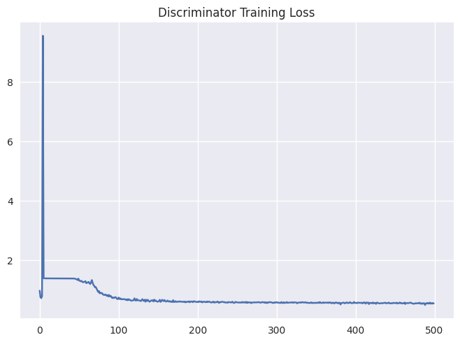 | 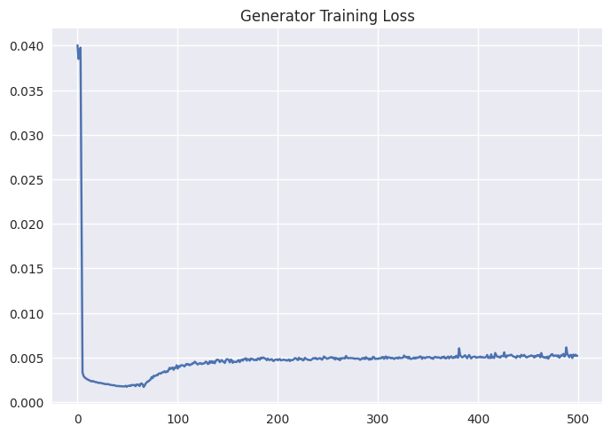 |


## Results

### Metrics
ERA5-SWVL1-SR achieved an average PSNR of 29.5, an average SSIM of 0.88, a MSE about 1e-3 with a MAE about 1e-2 on a holdout set of ERA5 Land Data. The PSNR value is close to state-of-the-art PSNR performance for [x4 upscaling](https://paperswithcode.com/sota/image-super-resolution-on-set5-4x-upscaling).

| Metric | Value  |
| ------ | ------ |
| PSNR   | 29.584 |
| SSIM   | 0.8814 |
| MSE    | 0.0011 |
| MAE    | 0.0132 |

### Visuals based on unseen data
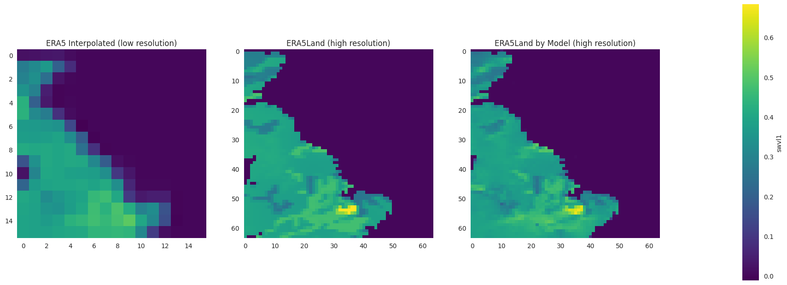
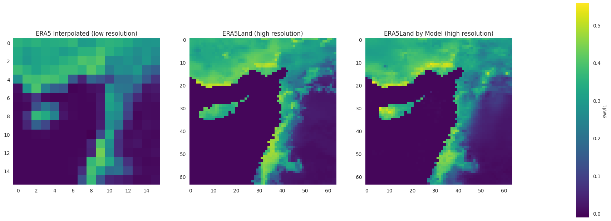
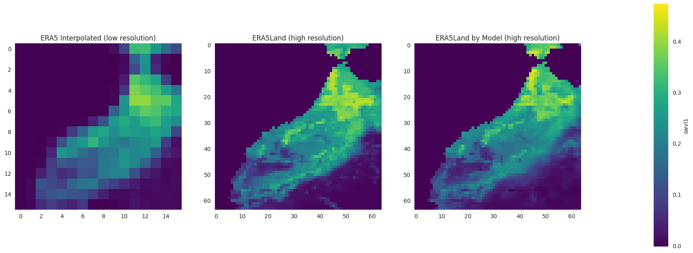
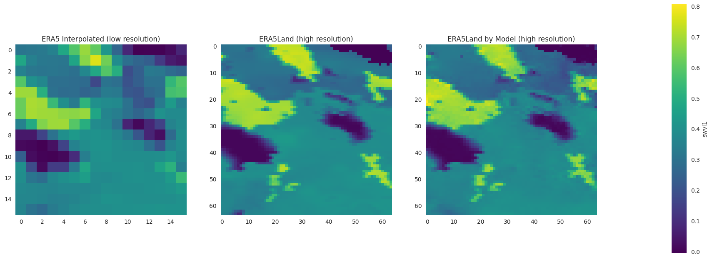
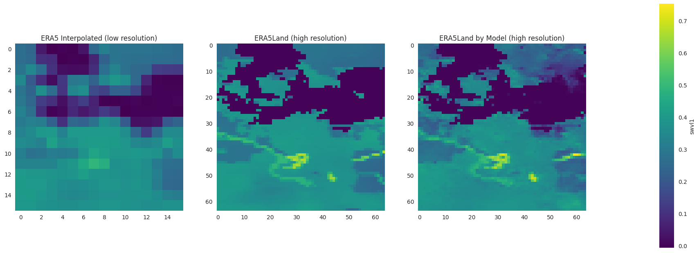
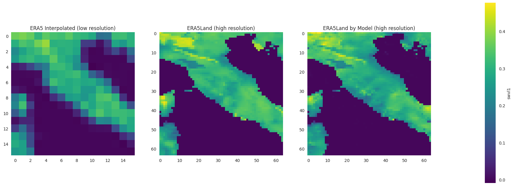
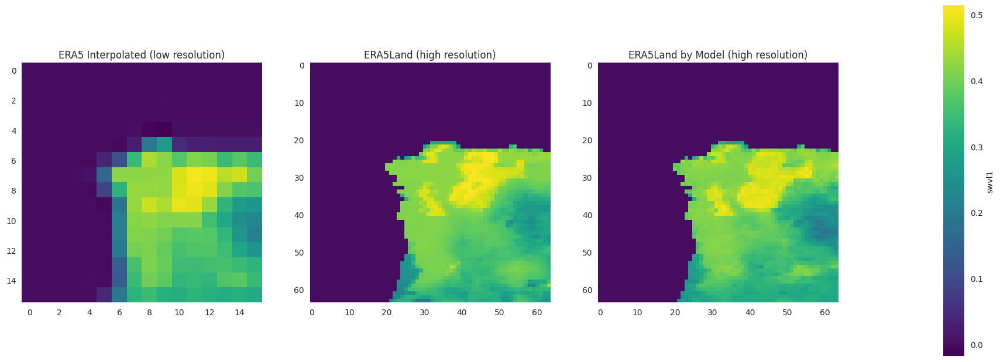


## Usage
To run this project, you will need to install the following dependencies:

1. Set up a Python Virtual Environment
```bash
# Clone the repository
git clone https://github.com/RudolfWorou/era5-swvl1-srgan.git

# Navigate to the project directory
cd era5-swvl1-srgan

# Create a virtual environment
python -m venv venv_name

# Activate the virtual environment
source venv_name/bin/activate
```

2. Install Dependencies

Make sure you have pip installed. Then, install the required packages using:
```
pip install -r requirements.txt
```
3. Run the Jupyter Notebooks

Run the notebook [era5_swvl1_sr.ipynb](era5_swvl1_sr.ipynb) to train the model or downscale ERA5 swvl1 data.

## Acknowledgments
Big thanks to everyone who has helped during this project.

## References

[C.  Lediget  al.,  “Photo-realistic  single  image  super-resolution  using  a  generativeadversarial network” inProceedings of the IEEE Conference on Computer Vision andPattern Recognition(IEEE, 2017), pp. 4681–4690.](https://arxiv.org/pdf/1609.04802.pdf)

[K. Stengel, A. Glaws, D. Hettinger, R.N. King Adversarial super-resolution of climatological wind and solar data Proc Natl Acad Sci, 117 (29) (2020), pp. 16805-16815, 10.1073/pnas.1918964117](https://www.pnas.org/doi/10.1073/pnas.1918964117)

[B. Lim, S. Son, H. Kim, S. Nah, and K. M. Lee. Enhanced deep residual networks for single image super-resolution. In CVPRW, 2017.](https://arxiv.org/pdf/1707.02921.pdf)

[Wang, Xintao, et al. "ESRGAN: Enhanced Super-Resolution Generative Adversarial Networks." *European Conference on Computer Vision (ECCV)*, 2018.](https://arxiv.org/pdf/1809.00219.pdf)

[ERA5 swvl1 parameter details](https://codes.ecmwf.int/grib/param-db/?id=39)
## Contributing

Thank you for your interest in contributing to this project! Contributions are welcome. However, before making any changes, please reach out to me via email at [rudolfworou@gmail.com](rudolfworou@gmail.com) to discuss the proposed changes.

To contribute to this project, please follow these steps:

1. Fork the repository and create your own branch for the changes.
2. Make the desired changes and improvements in your branch.
3. Ensure that your code adheres to the project's coding guidelines and best practices.
4. Test your changes thoroughly.
5. Submit a pull request with a clear description of the changes you have made and the purpose of those changes.

I will review the pull request and provide feedback as soon as possible. I appreciate your time and effort in contributing to this project!

## License
This project is distributed under the [MIT License](LICENSE).

## Roadmap
To be defined depending on the feedbacks.

## Contact

If you have any questions or need further clarification, feel free to reach out to me via email at [rudolfworou@gmail.com](rudolfworou@gmail.com). Thank you!